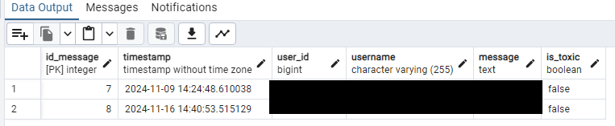
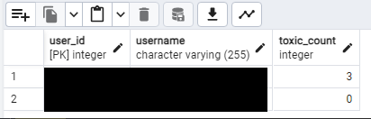
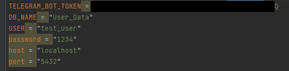

# NoToxicBot

## English

This project is a continuation of the project on [identifying toxic comments](https://github.com/KirillXL/ML_practic_bad_comment). In this project I want to use the same model, but for Telegram messenger - the bot should detect toxic comments and delete them, in case of writing many such comments mutate the user, and in case of strong violations - kick from the server.
### How to use the bot: 
0) create a bot using BotFather in Telegram
1) Download the archive with the bot, unzip into a convenient folder
2) Create a PostgreSQL database, create tables as shown in the image.

3) Create “.env” file file “.env”, write data into it as on the image.

4) Run the main file

### Possible errors:
- During personal correspondence with the bot some functions do not work as they should, the bot is configured to work in a group
- The model has little test data, does not take into account the context and does not work with emoji and English.
- Bot works only when main file is running

Translated with DeepL.com (free version)

## Русский

Этот проект - продолжение проекта по [определению токсичных комментариев](https://github.com/KirillXL/ML_practic_bad_comment). В данном проекте я хочу использовать ту же модель, но для мессенджера Telegram - бот должен выявлять токсичные комментарии и удалять их, при написании множества таких комментариев муте пользователя, а при сильных нарушениях - кикать с сервера .
### Как использовать бота: 
0) создать бота с помощью BotFather в Телеграмм
1) Скачать архив с ботом, разархивировать в удобную папку
2) Создать базу данных данных PostgreSQL, создать таблицы как на изображении

3) Создать файл ".env" , прописать в него данные как на изображении

4) Запустить файл main

### Возможные ошибки:
- При личной переписке с ботом некоторые функции не работают как должны, бот настроен на работу в группе
- Модель имеет мало тестовых данных, не учитывает контекст и не работает с эмодзи и английским языком
- Бот работает только при запущенном файле main